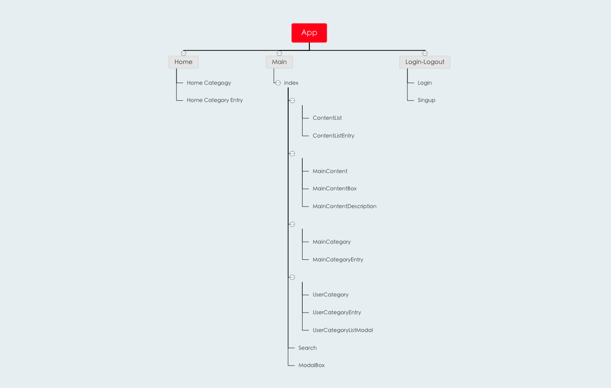

# My Type

- My Type 은 사용자가 원하는 유튜브 영상을 자신만의 카테고리로 관리 할 수 있는 웹 어플리케이션입니다.
- 또한 My type에서 제공하는 기본 추천 카테고리를 이용할 수 있고, 검색기능을 통해 다른 주제의 영상들도 자유롭게 검색이 가능합니다.
- 로그인, 로그아웃, 회원가입이 가능하여 가입한 유저들에 한해 나만의 카테고리 기능을 사용할 수 있게 하였습니다.
- 추가로 구글 소셜 로그인을 통해 회원가입 및 로그인의 편의성을 높였습니다.

## | 시연영상 |

## | 주요기능 |

- 로그인, 로그아웃, 회원가입
- 구글 로그인 API를 통한 소셜 로그인
- 유튜브 영상 검색
- 추천 카테고리 영상 랜더
- 나만의 카테고리 생성
- 나만의 카테고리에 원하는 영상 추가 및 삭제

## | 주요 스택 |

- react, redux

## | 파일 구조 |

- pages 폴더: 상위 컴포넌트로 HOME, MAIN, LOGIN, SIGNUP 등 페이지 별 랜더되는 컴포넌트
- components 폴더: 하위 컴포넌트로 HOME, MAIN 안에서 랜더되는 컴포넌트
- modules 폴더: redux 액션 정의

## | React Component Map |

